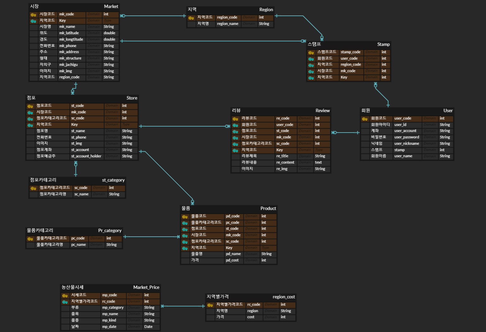
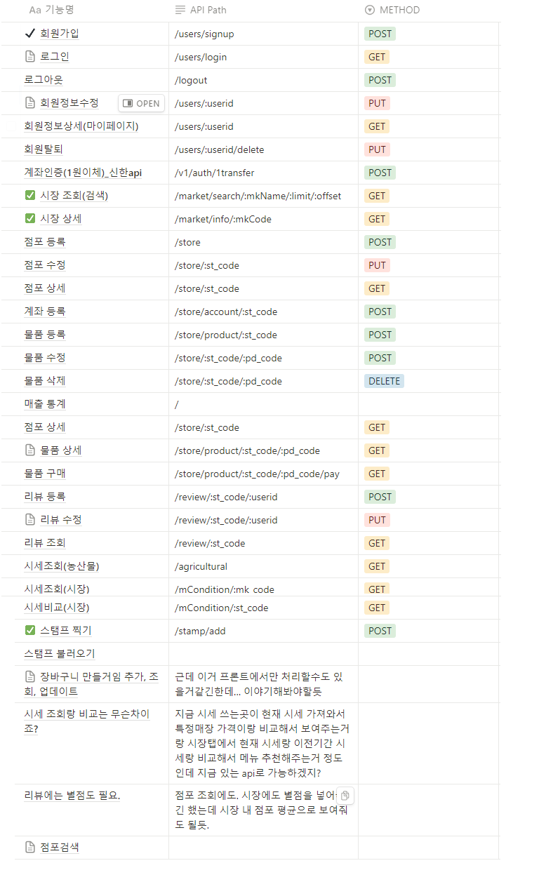
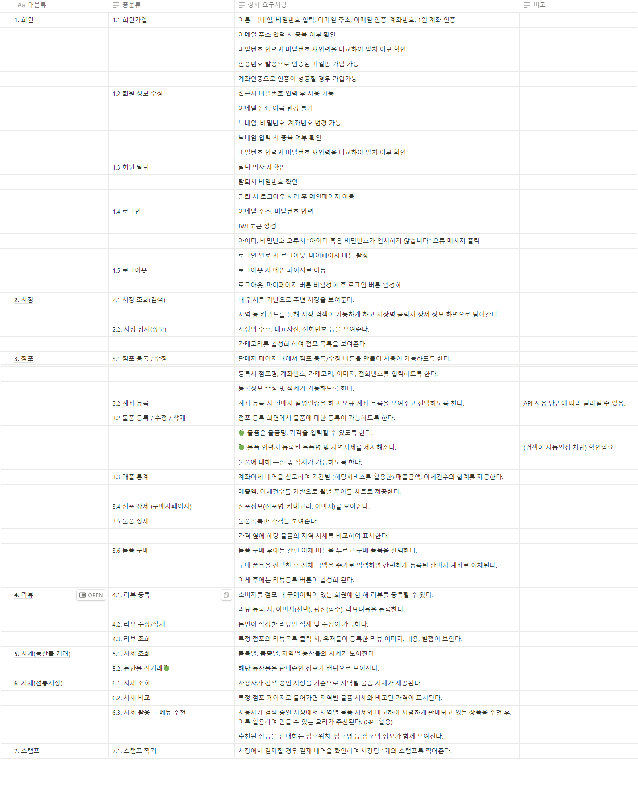

# 🛒짱보러갈래?🛒

    

## 📅 프로젝트 개요

🥕 **개발 기간** : 2023.08.30 ~ 2023.09.17 (총 2.5주)

🥕 **팀원 소개**
|  |  |  ||
| :----------------------------------------: | :----------------------------------------: | :-----------------------------------------: | :----------------------------------------: |
| [👑 정민희](https://github.com/mongmong22) | [정재웅](https://github.com/chachapapa) | [이채영](https://github.com/chaeyeong222) | [김민식](https://github.com/DUDINGDDI) |
| BE(팀장) | FE | BE | BE |

🥕 **기획 배경(목적)**

- 공중파 예능에서 논란이 되었던 전통시장 과자 바가지 사건. 해당 사건은 폐쇄적으로 운영되고 있던 전통시장의 특성때문에 일어난 일이었습니다.
- 소비자들에게 전통시장 내 상품들의 시세정보를 제공하여 현명한 소비를 할 수 있도록 유도하고
- 시장 내 점포들에게 점포를 홍보할 수 있는 창구를 마련해 줌으로써
- 결과적으로는 전통시장의 활성화를 목표로 프로젝트를 기획하였습니다.

🥕 **핵심 기능**

- KAMIS의 원자재 시세정보 제공
- 지도 내 시장 검색 서비스
- 시장 내 점포 정보, 상품 정보와 더불어 평균가와의 비교정보 제공
- 제품 별 최저가 매장 추천 서비스
- 제품에 대한 바로결제 서비스
- 시장 별 스탬프 모으기 서비스

 

## 🥩 서비스 소개

###  _짱보러갈래?_

> 🍚 전통시장에 대한 시세정보와 바로결제 서비스를 제공하는 어플리케이션

 

## ⚙️ 기술 스택

<h4>💻 FRONTEND</h4>

 

<h4>💻 BACKEND</h4>

 

<h4>🌐 CI/CD</h4>

 

<h4>🗄 DB</h4>

 

<!-- ## 📝 포팅 메뉴얼

### [바로가기](./exec/포팅메뉴얼.md)

  -->

## ⚙️ 개발 과정

- git flow 를 전적으로 따랐으며 rebase를 적극 활용하는 시도를 했다.

 

## 🎨 프로토타입

 

## 🗂️ ERD

 

## 🗒️ 명세서

**[API 명세서](https://well-turkey-82f.notion.site/API-7eb4ecb52f604d558666527680695f8e?pvs=4)**

**[기능 명세서](https://well-turkey-82f.notion.site/94b7a0dfa5954f6c98a43e53454c5c1b?pvs=4)**

 

## 📂 아키텍쳐

<!--  -->

 

## 😊 서비스 화면

| 회원 가입      | 나무 생성      | 정원 목록 확인 |
| --------------------------------------------------- | --------------------------------------------------- | --------------------------------------------------- |
|  |  |  |

| 열매 확인      | 나무 검색      | 정원 생성      |
| --------------------------------------------------- | --------------------------------------------------- | --------------------------------------------------- |
|  |  |  |

| 정원 조회      | 나무/꽃 심기      | 열매 달기      |
| --------------------------------------------------- | ------------------------------------------------------ | --------------------------------------------------- |
|  |  |  |

| 관리자 화면       |
| ------------------------------------------------------ |
|  |

  

## 프로젝트 버전 관리

<!-- - ver1.0.0

  - 최초 배포
  - 이미지 생성 및 저장 가능
  - 정원 생성 및 가입, 초대(공유)
  - 실시간 알림 서비스

- ver1.1.0(예정)
  - 맵 템플릿 추가 및 변경 가능
  - 정원 내 접속 인원들 간 채팅 기능 -->
